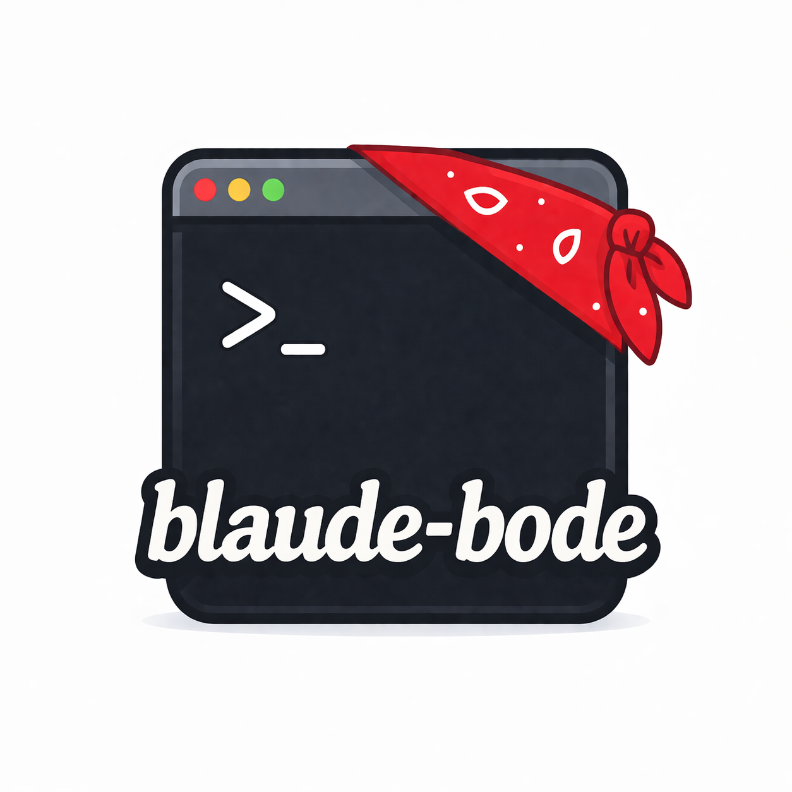

<p align="center">
  
</p>

# blaude-bode

A set of model-agnostic skills that run the same in Claude Code and Codex. No forks, no special casing, just portable building blocks you can drop in anywhere.

Keep your [bool](https://www.youtube.com/shorts/V9oO2JparNI).

---

## Quick start

```bash
# Install to all detected tools (claude, codex)
./install.sh

# Install to a specific tool
./install.sh --host claude
./install.sh --host codex

# Rebuild Codex output after editing skill bodies
./build.sh

# Optionally auto-refresh Codex output from git hooks
./bin/install-git-hooks

# Run Codex build/install regression checks
./test.sh
```

After install, Claude skills are available as `/[name]` slash commands. Codex gets generated skill directories plus per-agent TOML files.

---

## Layout

- `skills/`: canonical skill definitions
- `agents/`: canonical subagent definitions
- `bin/`: reusable helper scripts
- `bin/lib/`: shared shell helpers for build/install scripts
- `dist/codex/`: generated Codex artifacts
- `AGENTS.md`: repo-local Codex guidance for contributors
- `CLAUDE.md`: repo-local Claude guidance for contributors

## How it works

Skills and agents are directory-scoped markdown sources. Each canonical source file carries YAML frontmatter followed by a markdown body shared with both tools.

- **Claude Code** gets source symlinks. Skills install as directory symlinks; agents install as markdown file symlinks.
- **Codex** gets generated artifacts. `build.sh` parses frontmatter, preserves hook intent as manual parity notes, mirrors supporting files, and generates `dist/codex/skills/<name>/SKILL.md` plus `dist/codex/agents/*.toml`.
- **Install** symlinks generated Codex skills into `~/.codex/skills/`, generated Codex agents into `~/.codex/agents/`, and canonical source content into `~/.claude/`.
- **Git hooks** are opt-in. `./bin/install-git-hooks` sets `core.hooksPath=.githooks` so staged canonical edits refresh generated Codex artifacts before commit, and branch changes refresh them after checkout or merge.

---

## Skill file reference

Canonical location: `skills/[name]/SKILL.md`

```markdown
---
# REQUIRED
name: skill-name
description: One-line description of when to use this skill.

# OPTIONAL - omit for all hosts
excluded_hosts:
  - claude

# CLAUDE-ONLY - stripped before Codex sees the file
allowed-tools:
  - Bash
  - Read
  - Edit
  - Grep
requires:
  - git
  - gh
hooks:
  pre-invoke: |
    echo "running before skill"
  post-invoke: |
    echo "running after skill"
---

Skill body starts here. This exact content appears in every non-excluded host.
Write instructions in plain markdown. No frontmatter syntax here.
```

### Field compatibility table

| Field | Required | Claude | Codex | Notes |
|---|---|---|---|---|
| `name` | yes | yes | yes | Used as the skill identifier in both tools; keep `skills/[name]/` aligned with it |
| `description` | yes | yes | yes | Shown in each host's skill picker/listing |
| `excluded_hosts` | no | controls install | controls generation | YAML list of hosts to hide from. Valid values: `claude`, `codex`. Omit for all hosts |
| `allowed-tools` | no | yes | no | Pre-approves tools; omit to allow all |
| `requires` | no | yes | no | Warns at install if tool not on PATH |
| `hooks.pre-invoke` | no | yes | manual parity note | Shell run before skill executes in Claude; emitted as a manual note for Codex |
| `hooks.post-invoke` | no | yes | manual parity note | Shell run after skill completes in Claude; emitted as a manual note for Codex |

`build.sh` keeps only `name` and `description` in generated Codex `SKILL.md` files. Claude-only frontmatter is stripped, except that hook commands are rendered as plain markdown notes so Codex users still see the required shell steps.
Skill directory names are part of the contract: `skills/[name]/SKILL.md` must have frontmatter `name: [name]`.

---

---

## Agent file reference

Canonical location: `agents/[name]/AGENT.md`

Agents are specialized subprocesses with their own system prompt and model settings. A skill coordinates work; an agent does focused, isolated work.

```markdown
---
# REQUIRED
name: swift-testing-agent
description: When to spawn this agent. Used by Claude's /agents picker and Codex invocation.

# OPTIONAL - omit for all hosts
excluded_hosts:
  - codex

# Claude-only (Claude ignores unknown fields like codex:)
model: claude-sonnet-4-6
tools:
  - Bash
  - Read
  - Grep

# Codex-only (Claude ignores this block)
codex:
  model: gpt-5.4
  model_reasoning_effort: high   # high | low
  sandbox_mode: read-only        # read-only | workspace-write (optional)
  nickname_candidates:
    - Scout
    - Lens
    - Audit
---

Agent system prompt here. Shared verbatim between every non-excluded host.
Write instructions in plain markdown.
```

### Agent field compatibility table

| Field | Required | Claude | Codex | Notes |
|---|---|---|---|---|
| `name` | yes | yes | yes | Used as identifier in both tools |
| `description` | yes | yes | yes | Shown in Claude picker; used by Codex for agent selection |
| `excluded_hosts` | no | controls install | controls generation | YAML list of hosts to hide from. Valid values: `claude`, `codex`. Omit for all hosts |
| `model` | no | yes | no | Claude model ID; Codex model goes in `codex.model` |
| `tools` | no | yes | no | Pre-approved tools for Claude |
| `codex.model` | no | no | yes | Codex model ID |
| `codex.model_reasoning_effort` | no | no | yes | `high` or `low` |
| `codex.sandbox_mode` | no | no | yes | `read-only` or `workspace-write` |
| `codex.nickname_candidates` | no | no | yes | Optional YAML list used to give Codex better agent display names |

The markdown body becomes the agent's system prompt in both tools. All frontmatter is stripped from the Codex TOML's `developer_instructions` field.

### Skills vs. agents

| | Skill | Agent |
|---|---|---|
| **Purpose** | Instructions/workflow for the main model | Isolated subprocess with its own context |
| **Invoked by** | User via `/[name]` slash command | Parent model spawning a subprocess |
| **Has own model** | No (inherits session) | Yes (can override) |
| **Has own tools** | Yes (`allowed-tools`) | Yes (`tools`) |
| **Claude location** | `~/.claude/skills/[name]` | `~/.claude/agents/[name].md` |
| **Codex format** | `~/.codex/skills/[name]/SKILL.md` | `~/.codex/agents/[name].toml` |

Agent naming convention:
- Use an `-agent` suffix for subagents to avoid collisions with skill names in Codex and Claude.
- Keep the directory name aligned with the name: `agents/[name]/AGENT.md`.

The intended authoring model is:

1. Put shared behavior in the markdown body.
2. Put Claude runtime controls in frontmatter.
3. Put Codex runtime controls under `codex:`.
4. Use `excluded_hosts` only when a source entry should be hidden from one host.
5. Let `build.sh` translate source files instead of forking separate host-specific copies.

---

## Adding a new skill

1. Create `skills/[name]/SKILL.md` using the template above.
2. Fill in `name` and `description` (required). Add other fields as needed.
3. Write the skill instructions in the body (after the closing `---`).
4. Run `./build.sh` to update `dist/codex/skills/[name]/SKILL.md`.
5. Run `./install.sh` once to create the Claude symlink and refresh Codex output if needed.
6. Edit the skill body freely. Claude picks up changes immediately via symlink. For Codex, re-run `./build.sh`.

If git hooks are installed with `./bin/install-git-hooks`, staged changes under `skills/` automatically run `./build.sh` before commit. Adding, removing, or renaming a skill still requires `./install.sh --host codex` once so local Codex symlinks are refreshed.

### Skills with supporting files

Some skills need additional files (reference docs, scripts, etc.) alongside `SKILL.md`. Put everything in the same source directory:

```
skills/
  mermaid-author/
    SKILL.md
    references/
      diagram-types.md
```

Install symlinks the whole source directory into Claude. The skill body can reference sibling files with relative paths (e.g., `references/diagram-types.md`).

Codex mirrors the same support files into `dist/codex/skills/[name]/`, then installs the generated skill directory into `~/.codex/skills/[name]/`. Relative references therefore work the same way in both hosts.

---

## Adding a new agent

1. Create `agents/[name]/AGENT.md` using the template above.
2. Fill in `name`, `description`, and the system prompt body (required).
3. Add `model`, `tools`, and `codex:` fields as needed.
4. Run `./build.sh` to generate the Codex TOML in `dist/codex/agents/`.
5. Run `./install.sh` once to create symlinks for both Claude and Codex.
6. Edit the agent body freely. Claude picks it up immediately. For Codex, re-run `./build.sh`.

If git hooks are installed with `./bin/install-git-hooks`, staged changes under `agents/` automatically run `./build.sh` before commit. Adding, removing, or renaming an agent still requires `./install.sh --host codex` once so local Codex symlinks are refreshed.

---

## Git hooks

Run this once per clone to enable repo-local hooks:

```bash
./bin/install-git-hooks
```

The tracked hooks do three things:
- `pre-commit` runs `./build.sh` when staged changes touch `skills/`, `agents/`, `build.sh`, or `bin/lib/frontmatter.sh`.
- `post-checkout` and `post-merge` run `./build.sh` when branch changes touch those same paths.
- When a `SKILL.md` or `AGENT.md` entrypoint is added, removed, or renamed, the hook prints a reminder to run `./install.sh --host codex`.

These hooks keep generated Codex artifacts fresh for installed symlinks. They do not make a running Codex or Claude session hot-reload its available skills or subagents.

---

## bin/ convention

Put cross-platform shell scripts and CLI wrappers in `bin/`. Install creates symlinks from `~/.local/bin/` to these files.

Use `bin/` when:
- A helper is reused across multiple skills
- A wrapper normalizes behavior across OS/shell differences
- A thin shim is needed for a CLI that isn't always on PATH

Inline `Bash` in the skill body when:
- The command is specific to that one skill
- The logic is short and clear without abstraction

Skills that depend on a `bin/` script should list the script name under `requires:` so install warns if it's missing.

---

## Hooks reference

Hooks run shell commands at skill lifecycle points in Claude Code. Codex does not execute them automatically, so `build.sh` mirrors them into generated Codex `SKILL.md` files as manual parity notes.

```yaml
hooks:
  pre-invoke: |
    # Runs before the skill body executes.
    # Use for: checking prerequisites, setting env vars, printing context.
    git status --short

  post-invoke: |
    # Runs after the skill body completes.
    # Use for: logging, cleanup, notifications.
    echo "skill finished"
```

Hooks have access to the shell environment. They do not receive skill arguments. Keep them short and make the skill body resilient if the equivalent step needs to be run manually in Codex.

---

## Example sources

See [skills/mermaid-author/SKILL.md](skills/mermaid-author/SKILL.md) for a skill with supporting reference files, and [agents/swift-testing-agent/AGENT.md](agents/swift-testing-agent/AGENT.md) for a shared Claude/Codex agent source.

## License

MIT. See [LICENSE](LICENSE).
