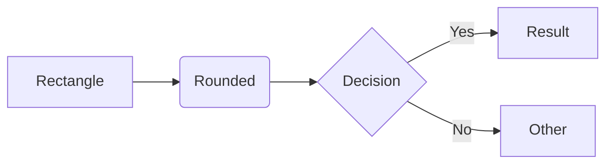
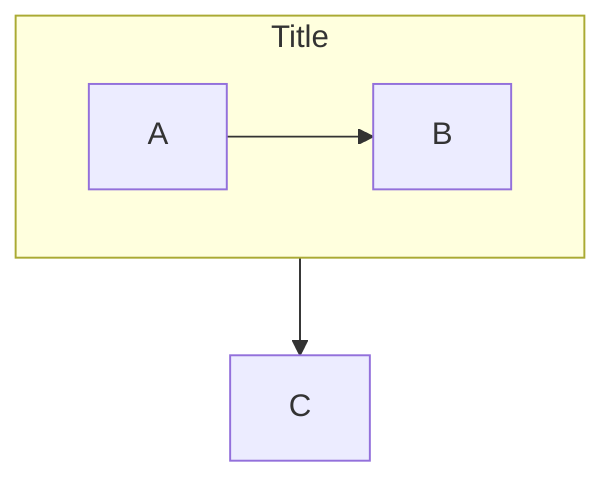
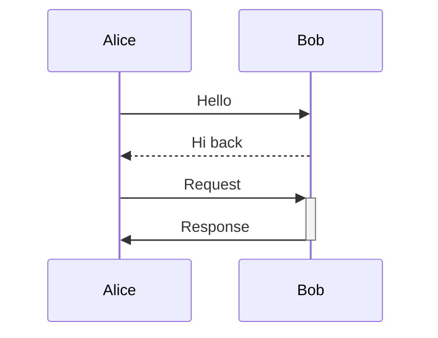
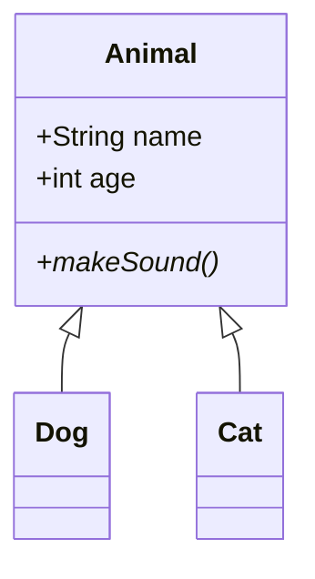
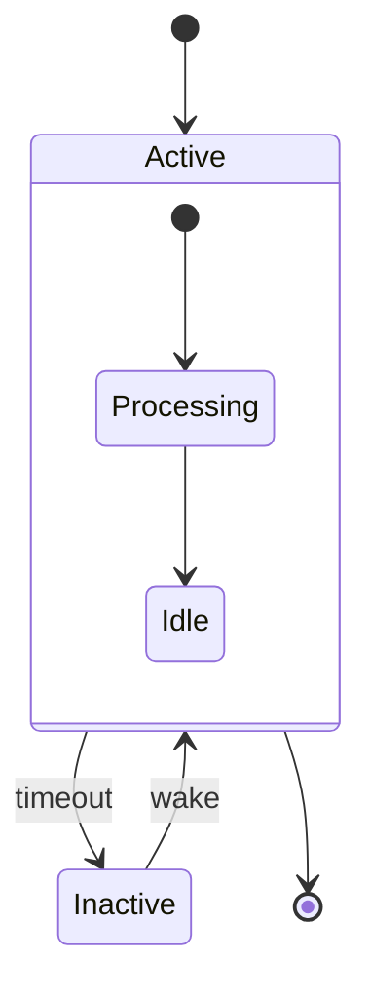
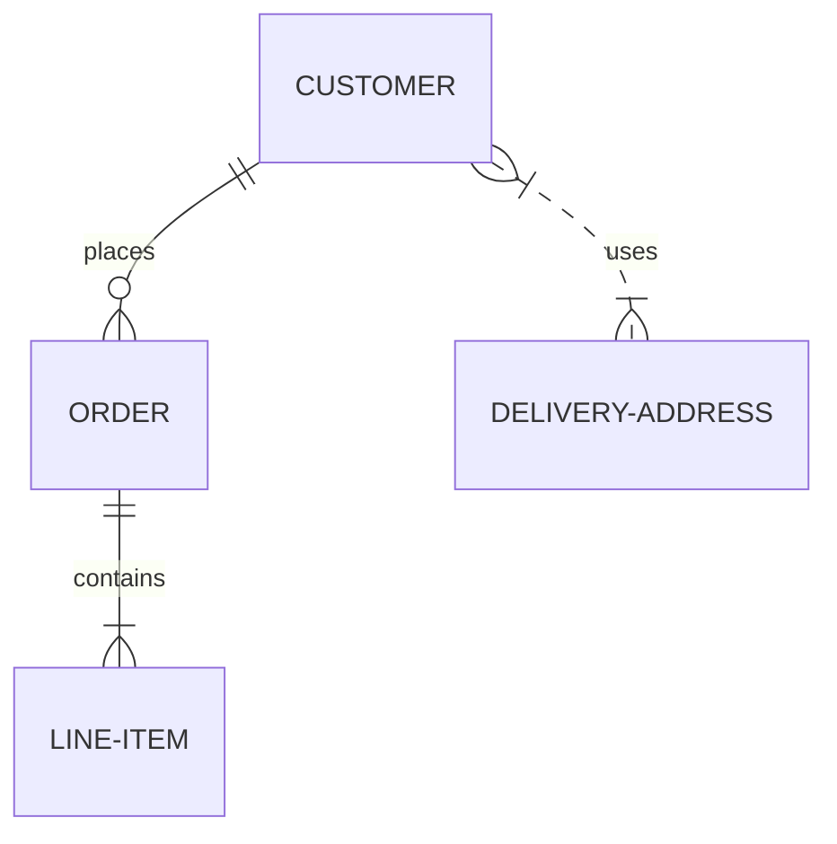
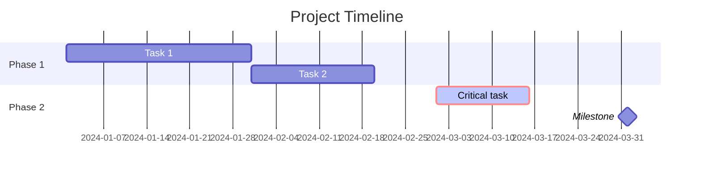

# Mermaid Diagram Authoring

This skill covers correct mermaid.js syntax for all diagram types, with emphasis on the parser pitfalls that cause silent failures or broken renders.

## Critical Rules (applies to ALL diagram types)

These are the most common causes of broken mermaid diagrams. Internalize them before writing any diagram.

### 1. Never use literal `\n` in node text or labels

The mermaid parser does not interpret `\n` as a newline in most contexts. It either renders literally or breaks parsing.

**For line breaks, use one of these approaches:**
- `<br/>` tags inside quoted strings (works in flowchart nodes, NOT in sequence diagram messages or subgraph titles)
- Markdown strings with actual newlines (wrap text in backtick-quotes): `` "`Line 1\nLine 2`" `` where `\n` is an actual newline character
- For sequence diagram notes: use `<br/>` in the note text

**What breaks:**
```
A["First\nSecond"]     %% BAD - \n renders literally or breaks
A["First<br/>Second"]  %% GOOD - works in flowcharts
```

### 2. The word `end` is reserved

Lowercase `end` in node text, labels, or anywhere the parser scans will be interpreted as a block terminator (closing subgraphs, loops, alt blocks, etc.).

**Workarounds:**
- Capitalize: `End`, `END`, `Backend`
- Wrap in quotes: `A["Send end signal"]`
- Use parentheses/brackets: `A("end")`

### 3. Special characters that break syntax

These characters have syntactic meaning and will break parsing if used raw in text:

| Character | Problem | Solution |
|-----------|---------|----------|
| `(` `)` | Node shape delimiters | Wrap text in double quotes: `A("text(with parens)")` |
| `[` `]` | Node shape delimiters | Use quotes: `A["text[with brackets]"]` |
| `{` `}` | Node shape delimiters | Use quotes: `A{"text"}` or HTML entities |
| `#` | Entity prefix | Use `#35;` (mermaid entity) or wrap in quotes |
| `<` `>` | Arrow/HTML confusion | Use `#lt;` and `#gt;` or quotes |
| `:` | Separator in many diagram types | Wrap the entire text in quotes |
| `"` inside text | Terminates quoted strings | Double them: `A["say ""hello"""]` |
| `@` | Shape modifier (v11.3.0+) | Wrap in quotes if used in text |
| `~` | Generic type delimiter in class diagrams | Wrap in quotes |

**Mermaid entity syntax** (NOT standard HTML entities):
- Use `#35;` not `&#35;` for the `#` character
- Use `#lt;` / `#gt;` for angle brackets
- Use `#quot;` for double quotes

### 4. Node IDs starting with `o` or `x`

If a node ID starts with lowercase `o` or `x` and follows an edge, the parser interprets it as a circle-end (`--o`) or cross-end (`--x`) marker.

```
A --> oNode    %% BAD - parsed as A --o Node (circle edge)
A --> ONode    %% GOOD - capitalize
A --> o_node   %% BAD
A --> O_node   %% GOOD
```

### 5. Comments use `%%`, not `//` or `#`

```
%% This is a comment
A --> B  %% inline comment
```

Never use `%%{ }%%` inside comments, as it triggers directive parsing.

### 6. Whitespace and indentation matter in some diagrams

- **Mindmaps**: Hierarchy is entirely indentation-based. Inconsistent indentation creates wrong parent-child relationships.
- **Block diagrams**: Column layout depends on proper nesting.
- **General**: Avoid tabs; use spaces consistently.

---

## Diagram Type Reference

For detailed syntax of each diagram type, see `references/diagram-types.md`. Below is the quick-start for the most common types.

### Flowchart



**Directions**: `TB`/`TD` (top-down), `BT`, `LR`, `RL`

**Node shapes** (classic):
- `[text]` rectangle
- `(text)` rounded
- `([text])` stadium
- `((text))` circle
- `{text}` diamond
- `{{text}}` hexagon
- `[/text/]` parallelogram
- `[\text\]` parallelogram alt
- `[/text\]` trapezoid
- `[\text/]` trapezoid alt
- `[(text)]` cylinder
- `(((text)))` double circle
- `[[text]]` subroutine
- `>text]` asymmetric

**Edge types**:
- `-->` arrow
- `---` line (no arrow)
- `-.->` dotted arrow
- `==>` thick arrow
- `~~~` invisible link
- `--o` circle end
- `--x` cross end
- `<-->` bidirectional
- `-->|text|` or `-- text -->` text on edge

**Longer edges**: Add dashes/dots/equals: `---->`, `=====>`, `-..->`

**Subgraphs**:


**Styling**:
```
classDef highlight fill:#f96,stroke:#333,stroke-width:2px
A:::highlight
style B fill:#bbf,stroke:#f66
linkStyle 0 stroke:#ff3,stroke-width:4px
```

### Sequence Diagram



**Arrow types**:
- `->` solid, no arrow
- `->>` solid, arrowhead
- `-->` dotted, no arrow
- `-->>` dotted, arrowhead
- `-x` solid, cross
- `--x` dotted, cross
- `-)` solid, open (async)
- `--)` dotted, open (async)

**Activations**: `+` after arrow activates, `-` deactivates. Or use explicit `activate`/`deactivate`.

**Notes**: `Note right of A: Text` or `Note over A,B: Spanning note`

**Control flow**:
```
loop Every minute
    A->>B: Heartbeat
end

alt Success
    A->>B: OK
else Failure
    A->>B: Error
end

par Task 1
    A->>B: Do X
and Task 2
    A->>C: Do Y
end

critical Allocate resource
    A->>B: Lock
option Timeout
    A->>B: Retry
end
```

**Boxes**: Group participants:
```
box Purple Team Alpha
    participant A
    participant B
end
```

**Gotcha**: `<br/>` does NOT work in sequence diagram message text. Use `<br>` in notes only.

### Class Diagram



**Visibility**: `+` public, `-` private, `#` protected, `~` package

**Method modifiers**: `*` abstract, `$` static (after parentheses)

**Relationships**:
- `<|--` inheritance
- `*--` composition
- `o--` aggregation
- `-->` association
- `..>` dependency
- `..|>` realization

**Cardinality**: `ClassA "1" --> "*" ClassB : has`

**Generics**: Use tildes: `List~int~` (NOT angle brackets)

**Annotations**: `<<Interface>>`, `<<Abstract>>`, `<<Enumeration>>`

### State Diagram



**Special states**: `<<choice>>`, `<<fork>>`, `<<join>>`

**Concurrency**: Use `--` separator inside composite states

**Gotcha**: Cannot define transitions between internal states of different composite states.

### Entity Relationship Diagram



**Cardinality** (left side `||` right side):
- `||` exactly one
- `o|` zero or one
- `}|` one or more
- `}o` zero or more

**Line type**: `--` identifying (solid), `..` non-identifying (dashed)

**Attributes**:
```
CUSTOMER {
    string name PK
    string email UK
    int age
}
```

### Gantt Chart



**Task tags**: `done`, `active`, `crit`, `milestone` (place before dates)

**Dependencies**: `after taskId`

**Exclusions**: `excludes weekends` or `excludes 2024-12-25`

### Other Diagram Types

For pie, gitgraph, mindmap, timeline, C4, quadrant, user journey, block, and Sankey diagrams, see `references/diagram-types.md`.

---

## Configuration

### Frontmatter (recommended)

```
---
config:
  theme: forest
  look: hand-drawn
  layout: elk
---
flowchart LR
    A --> B
```

**Themes**: `default`, `forest`, `dark`, `neutral`, `base`

**Layouts**: `dagre` (default), `elk` (advanced, requires integration)

**Looks**: `classic` (default), `hand-drawn`

### Directives

```
%%{init: {"theme": "forest", "flowchart": {"curve": "stepBefore"}}}%%
flowchart LR
    A --> B
```

---

## Common Pitfalls Checklist

Before finalizing any mermaid diagram, verify:

1. No literal `\n` in any text (use `<br/>` or markdown strings)
2. No unquoted `end` in node text
3. No unquoted special characters `()[]{}#<>:` in text
4. Node IDs don't start with lowercase `o` or `x` after edges
5. Generics use `~Type~` not `<Type>` in class diagrams
6. `erDiagram` not `er-diagram` or `ERDiagram`
7. `sequenceDiagram` not `sequence-diagram`
8. `stateDiagram-v2` (v2 recommended for new diagrams)
9. `classDiagram` not `class-diagram`
10. Subgraph/loop/alt/par blocks all properly closed with `end`
11. No `%%{ }%%` inside comments
12. Quoted strings use `""` to escape internal quotes, not `\"`
13. Mermaid entities use `#code;` format, not `&#code;`
14. Commas in `stroke-dasharray` values escaped as `\,`
15. No tabs in mindmap indentation
