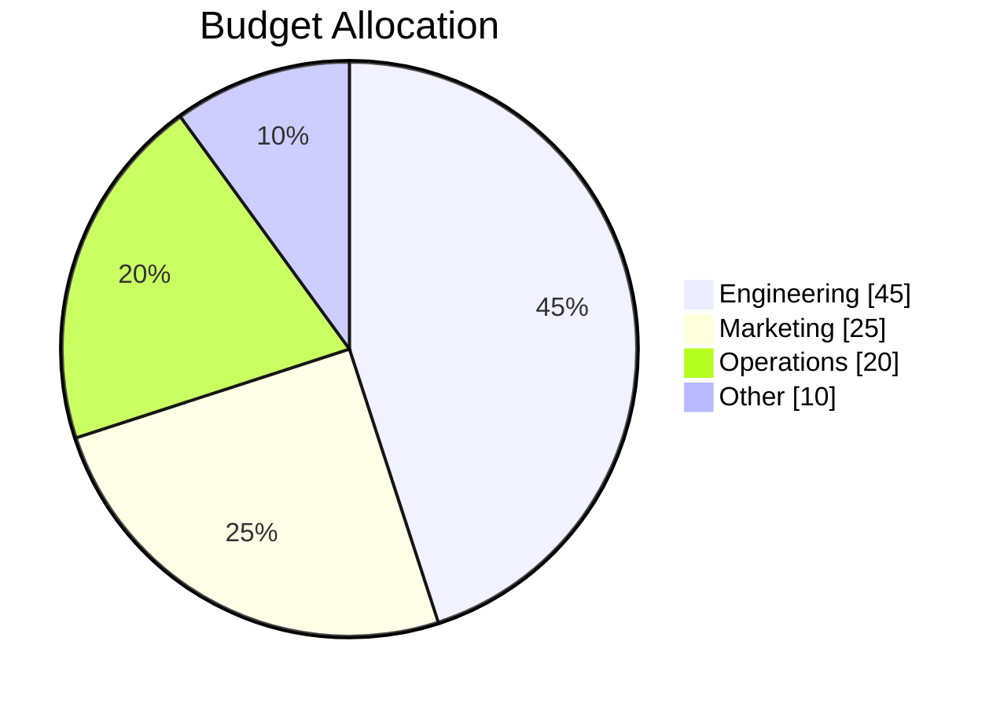
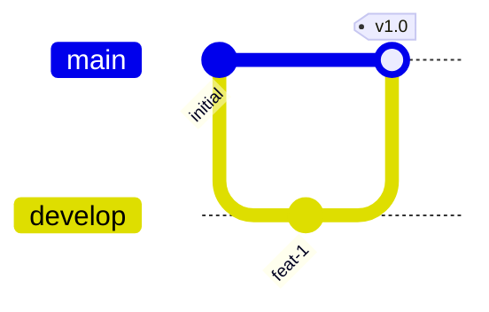
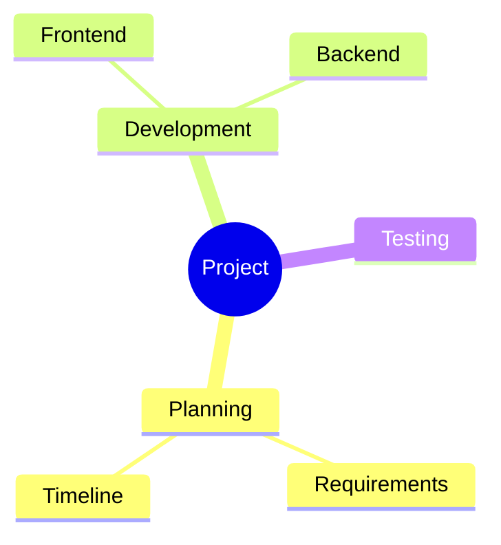
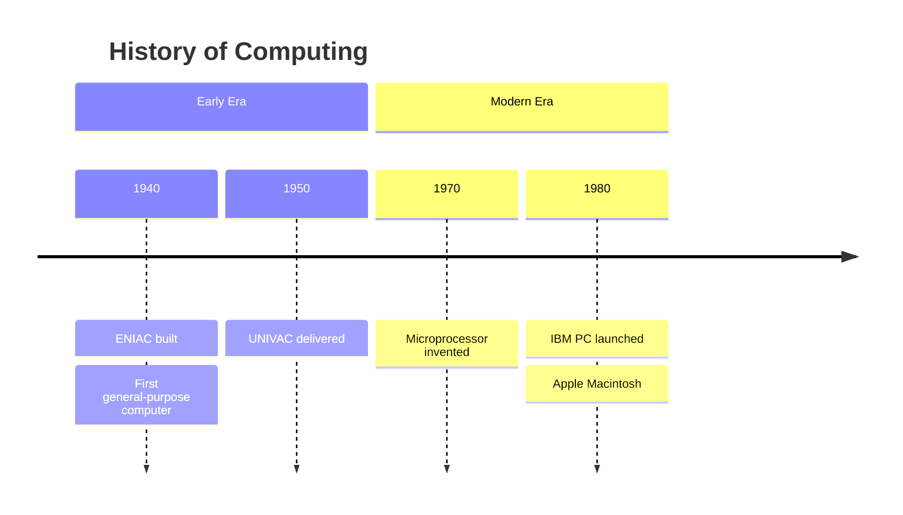
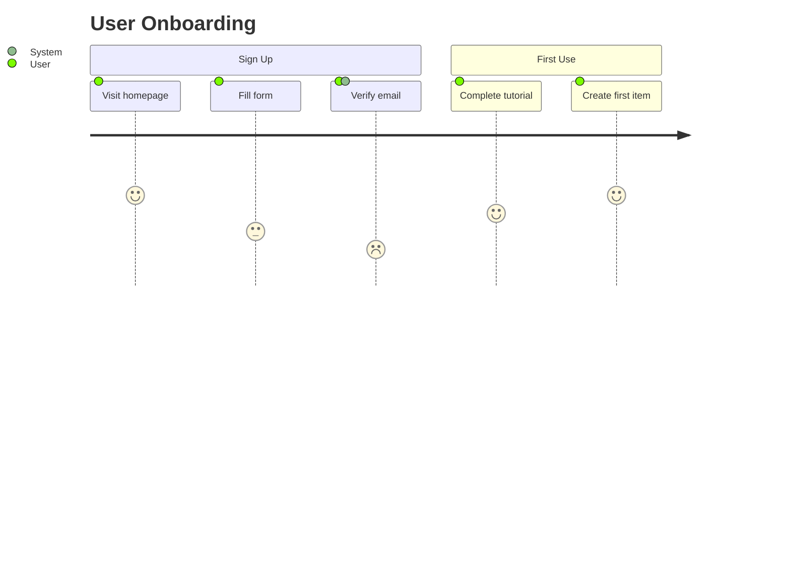
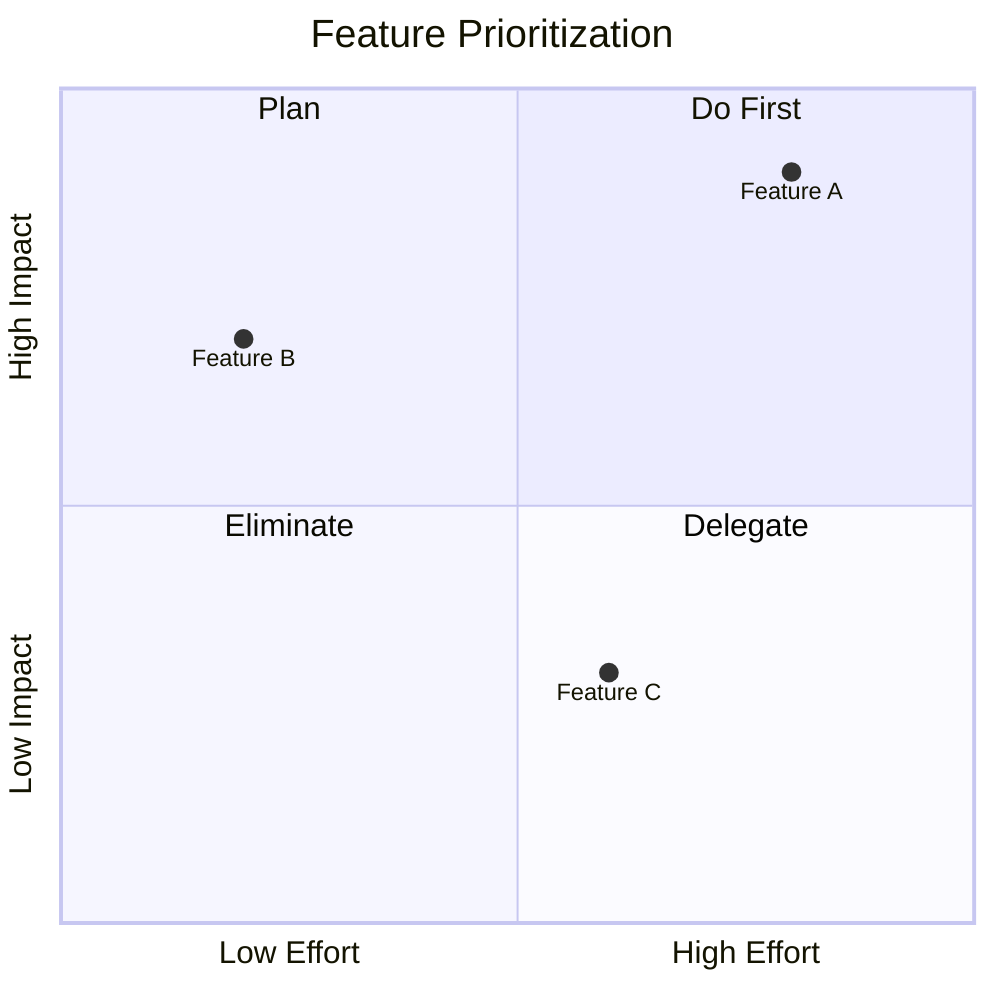
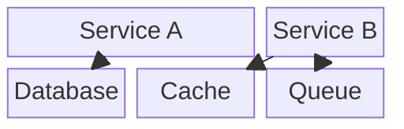
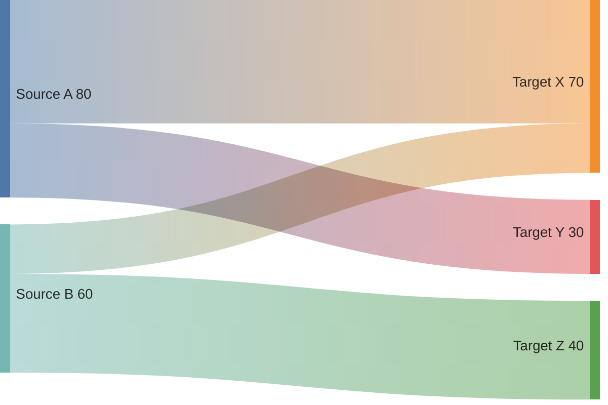
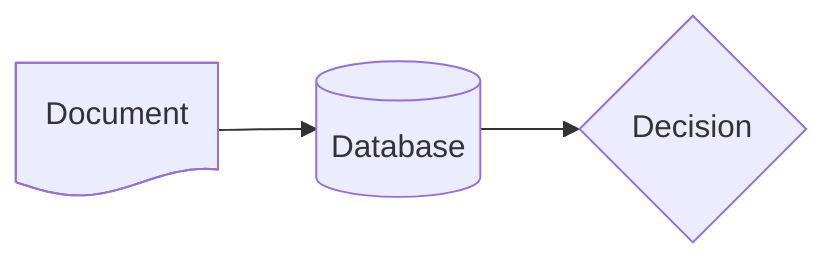

# Mermaid Diagram Types - Detailed Reference

## Table of Contents
1. [Pie Chart](#pie-chart)
2. [Git Graph](#git-graph)
3. [Mindmap](#mindmap)
4. [Timeline](#timeline)
5. [User Journey](#user-journey)
6. [Quadrant Chart](#quadrant-chart)
7. [C4 Diagram](#c4-diagram)
8. [Block Diagram](#block-diagram)
9. [Sankey Diagram](#sankey-diagram)
10. [XY Chart](#xy-chart)
11. [Expanded Flowchart Shapes](#expanded-flowchart-shapes)
12. [Flowchart Advanced Features](#flowchart-advanced-features)
13. [Sequence Diagram Advanced Features](#sequence-diagram-advanced-features)

---

## Pie Chart



- Values MUST be positive numbers greater than zero
- Labels MUST be in double quotes
- Slices render clockwise in declaration order
- `showData` is optional, displays values alongside legend
- `textPosition` config: 0.0 (center) to 1.0 (edge), default 0.75

---

## Git Graph



**Commands**: `commit`, `branch`, `checkout` (or `switch`), `merge`, `cherry-pick`

**Commit attributes** (all optional, combinable):
- `id: "custom_id"` - custom identifier
- `type: NORMAL | REVERSE | HIGHLIGHT`
- `tag: "v1.0"` - release label

**Cherry-pick rules**:
- Target commit must have a custom `id`
- Commit cannot already exist on current branch
- Current branch must have at least one commit
- For merge commits, parent ID is mandatory

**Orientation**: `LR:` (default), `TB:`, `BT:` - declared at start

**Config**:
- `showBranches: true|false`
- `showCommitLabel: true|false`
- `mainBranchName: "main"` (customizable)
- `parallelCommits: true|false`

**Gotcha**: Branch theme variables cycle after 8 branches. The 9th branch reuses the 1st's colors.

**Gotcha**: Branch names that are mermaid keywords (like `cherry-pick`) must be wrapped in quotes.

---

## Mindmap



- Hierarchy is ENTIRELY indentation-based
- Use consistent spaces (not tabs)
- The actual indent amount doesn't matter, only relative depth compared to the previous line

**Node shapes**:
- `[Square]`
- `(Rounded)`
- `((Circle))`
- `{{Hexagon}}`
- `)Cloud(`
- `))Bang((`
- Default (no brackets): rounded rectangle

**Icons**: `::icon(fa fa-book)` after node text (requires font setup by site admin)

**Classes**: `:::className` after node text

**Gotcha**: Markdown strings support bold/italic but be careful with indentation. An extra or missing space changes the entire tree structure.

---

## Timeline



- Time periods and events are simple text (not limited to numbers/dates)
- Multiple events per period: separate with `:` on same line or use continuation lines
- `section` groups time periods with consistent coloring
- Use `<br>` for manual line breaks in long text
- Config: `disableMulticolor: true` makes all periods same color

**Status**: Experimental. Syntax may change in future releases.

---

## User Journey



- Scores range from 1 (worst) to 5 (best)
- Format: `Task name: score: actor1, actor2`
- Actors are comma-separated
- Sections group related tasks

---

## Quadrant Chart



- Coordinates range from 0.0 to 1.0
- Quadrant numbering: 1=top-right, 2=top-left, 3=bottom-left, 4=bottom-right
- Axis labels: `x-axis Left --> Right` (both ends) or `x-axis Label` (left only)

**Point styling**:
```
Feature A: [0.8, 0.9] radius: 12
Feature B: [0.2, 0.7] color: #ff3300, radius: 10
```

Or class-based:
```
Feature A:::urgent: [0.8, 0.9]
classDef urgent color: #ff0000
```

---

## C4 Diagram

C4 diagrams model software architecture at different abstraction levels.

**Types**: `C4Context`, `C4Container`, `C4Component`, `C4Dynamic`, `C4Deployment`

```
C4Context
    title System Context Diagram
    Person(user, "End User", "Uses the application")
    System(app, "Application", "Main system")
    System_Ext(email, "Email Service", "Sends notifications")
    Rel(user, app, "Uses", "HTTPS")
    Rel(app, email, "Sends mail", "SMTP")
```

**Elements**:
- `Person(alias, label, ?description)` / `Person_Ext`
- `System(alias, label, ?description)` / `System_Ext` / `SystemDb` / `SystemQueue`
- `Container(alias, label, ?technology, ?description)` / `Container_Ext` / `ContainerDb`
- `Component(alias, label, ?technology, ?description)` / `Component_Ext`

**Relationships**:
- `Rel(from, to, label, ?technology)`
- `BiRel(from, to, label)` - bidirectional
- `Rel_U`, `Rel_D`, `Rel_L`, `Rel_R` - directional hints

**Boundaries**:
```
System_Boundary(sb, "System") {
    Container(web, "Web App", "React")
    Container(api, "API", "Node.js")
}
```

**Deployment nodes**:
```
Deployment_Node(cloud, "AWS", "Cloud") {
    Deployment_Node(ec2, "EC2", "Compute") {
        Container(api, "API", "Node.js")
    }
}
```

**Style updates**:
- `UpdateElementStyle(alias, $bgColor="blue", $fontColor="white")`
- `UpdateRelStyle(from, to, $textColor="red", $offsetX="-40", $offsetY="20")`
- `UpdateLayoutConfig($c4ShapeInRow="3", $c4BoundaryInRow="2")`

**Gotchas**:
- Layout is NOT fully automatic. Reorder statements to adjust positioning.
- `Lay_U/D/L/R` directives are NOT supported
- Sprites, tags, and legends are not yet implemented
- Status: Experimental

---

## Block Diagram



- `columns N` sets the grid width
- `BlockName:N` spans N columns
- `space` or `space:N` creates empty cells
- Supports all flowchart node shapes
- Nested/composite blocks for hierarchical layouts

**Styling**: Same as flowcharts (`style`, `classDef`, `class`, `:::`)

**Gotcha**: Block diagrams give you explicit positional control unlike flowcharts. Elements are placed in grid order.

---

## Sankey Diagram



- Uses CSV format: `source,target,value`
- Exactly 3 columns per row
- Commas in values: wrap in double quotes `"Source, A",Target,50`
- Quotes in values: double them `"Source ""A""",Target,50`
- Empty lines allowed for readability

**Config**:
- `linkColor`: `source`, `target`, `gradient`, or hex color
- `nodeAlignment`: `justify`, `center`, `left`, `right`
- `width` / `height` in pixels

**Status**: Experimental (v10.3.0+)

---

## XY Chart

```
xychart-beta
    title "Sales Data"
    x-axis [Jan, Feb, Mar, Apr, May]
    y-axis "Revenue (thousands)" 0 --> 100
    bar [10, 20, 30, 45, 60]
    line [5, 15, 25, 40, 55]
```

- Supports `bar` and `line` series
- X-axis: categorical `[A, B, C]` or numeric range `0 --> 100`
- Y-axis: numeric range with optional label
- Multiple series overlay on same chart

**Status**: Experimental

---

## Expanded Flowchart Shapes (v11.3.0+)

The `@{ }` syntax provides 30+ semantic shapes:



**Shape names**: `rect`, `circle`, `diam`, `hex`, `stadium`, `doc`, `cyl`, `tri`, `fork`,
`lin-rect`, `div-rect`, `h-cyl`, `curv-trap`, `delay`, `notch-rect`, `bolt`, `brace`,
`brace-r`, `lean-r`, `lean-l`, `sm-circ`, `fr-circ`, `fr-rect`, `cross-circ`, `odd`,
`tag-doc`, `tag-rect`, `flag`, `hourglass`, `bow-rect`, `div-circ`, `win-pane`

**Icon nodes** (v11.7.0+):
```
A@{ icon: "fa:user", form: "circle", label: "User", pos: "b", h: 48 }
```

**Image nodes**:
```
A@{ img: "https://example.com/logo.png", label: "Logo", w: 60, h: 60 }
```

---

## Flowchart Advanced Features

### Edge IDs and Animation (v11.10.0+)

Assign IDs to edges for targeted styling and animation:
```
e1@-->|request| A B
e2@-.->|response| B A
```

Enable animation in config or style block:
```
{ e1: { animate: true, animation-speed: "fast" } }
```

### Markdown in Nodes

Wrap in backtick-quotes for markdown support:
```
A["`**Bold** and *italic*`"]
```

Actual newlines inside backtick-quotes create line breaks (this is the preferred way to get multiline text).

### Chaining

```
A --> B --> C --> D
A & B --> C & D    %% creates 4 edges: A->C, A->D, B->C, B->D
```

### Click Events

Requires `securityLevel: 'loose'`:
```
click A callback "Tooltip"
click B href "https://example.com" "Link tooltip" _blank
```

---

## Sequence Diagram Advanced Features

### Actor Creation and Destruction (v10.3.0+)

```
sequenceDiagram
    Alice->>Bob: Hello
    create participant Charlie
    Alice->>Charlie: Hi Charlie
    destroy Charlie
    Charlie->>Alice: Goodbye
```

- Only the recipient can be created via a message
- Either sender or recipient can be destroyed

### Participant Types

```
sequenceDiagram
    participant A as Alice
    actor B as Bob
```

`actor` renders a stick figure instead of a box.

### Sequence Numbers

Enable via config: `sequence: { showSequenceNumbers: true }` or `autonumber` directive.

### Highlighting

```
rect rgba(0, 0, 255, 0.1)
    A->>B: Highlighted interaction
end
```

### Actor Menus

```
link Alice: Dashboard @ https://example.com/dashboard
link Alice: Settings @ https://example.com/settings
```
